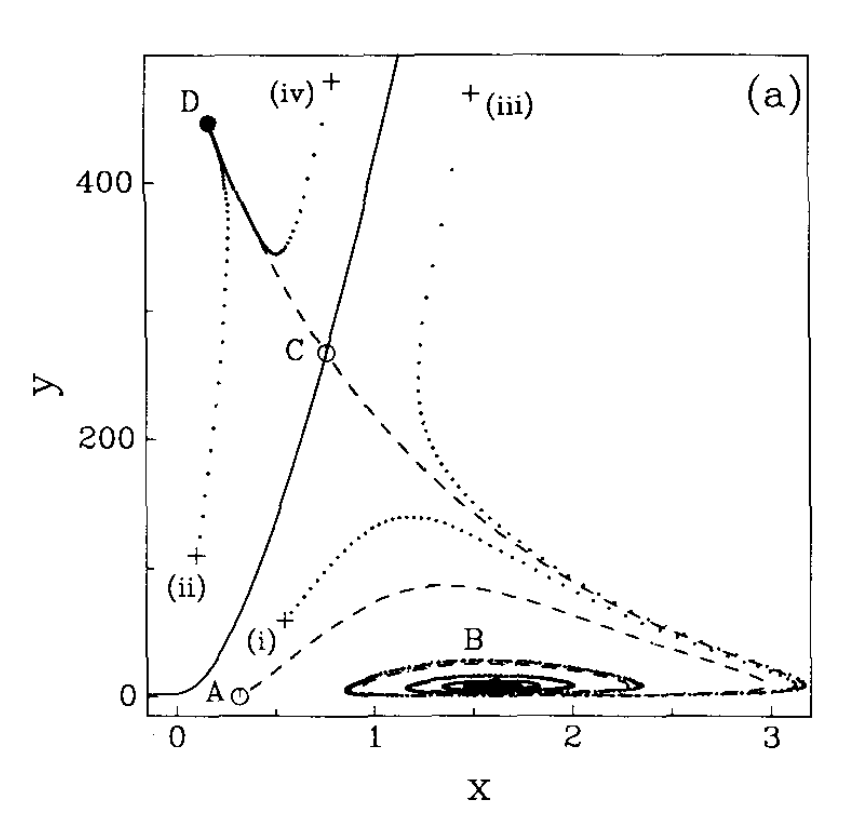
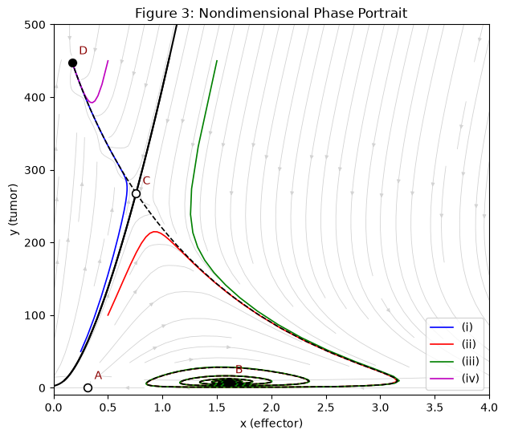
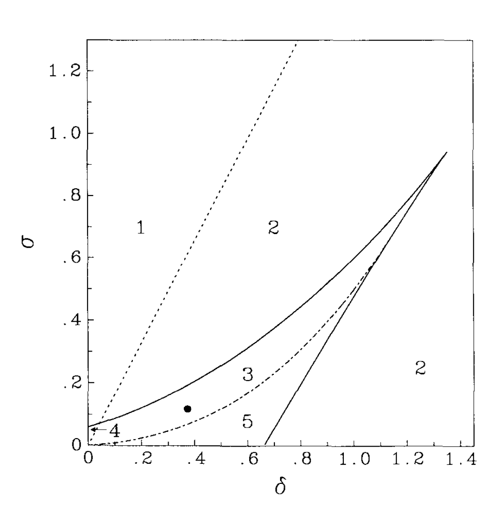
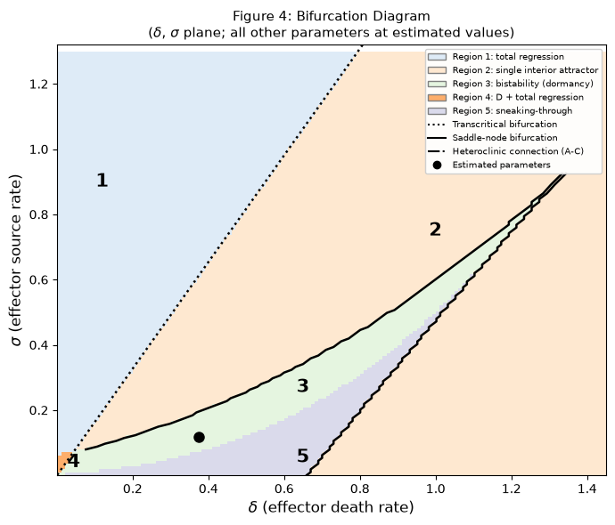
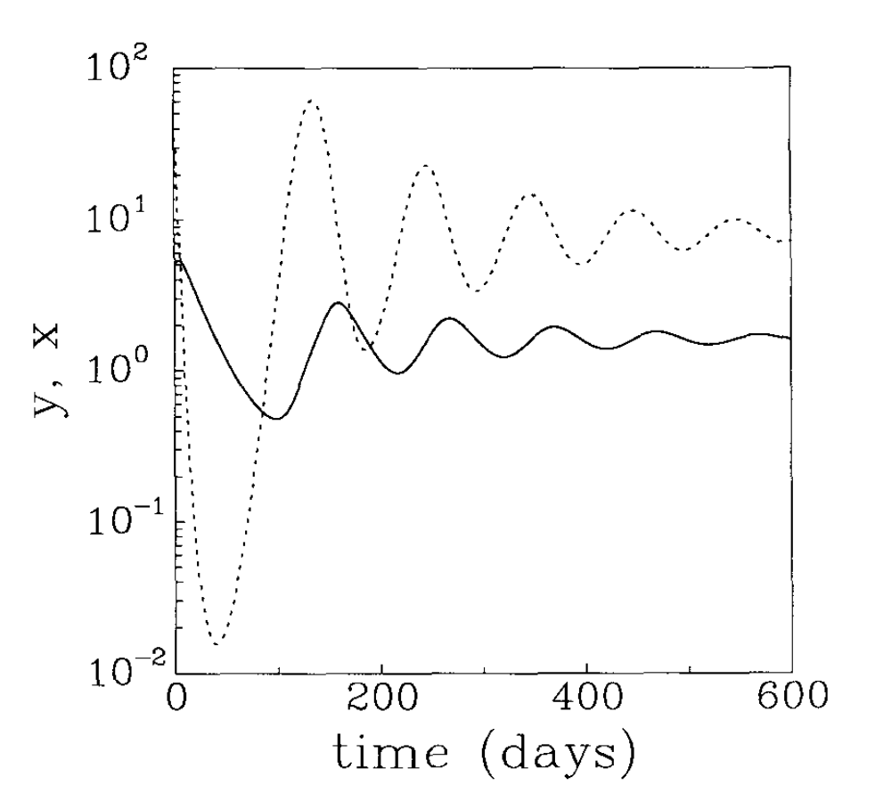
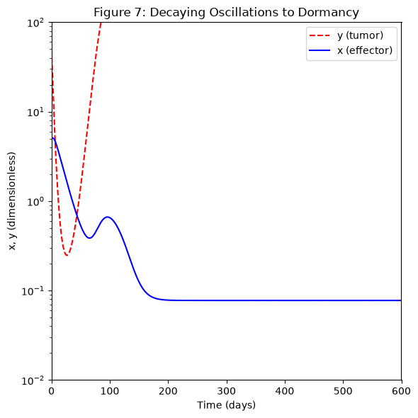
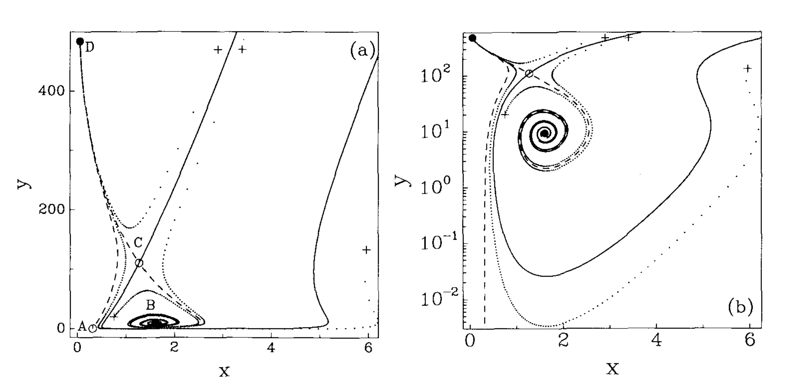
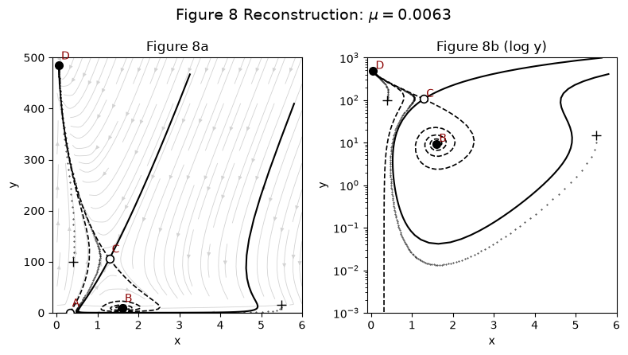

# Kuznetsov et al. 1994: Recreation

Computational recreation of:

> Kuznetsov, Makalkin, Taylor & Perelson (1994),
> *Nonlinear Dynamics of Immunogenic Tumors: Parameter Estimation and
> Global Bifurcation Analysis*, Bulletin of Mathematical Biology 56(2), 295-321.

The paper models effector immune cells and tumor cells with two ODEs and shows
that this is enough to produce tumor dormancy, escape, and "sneaking through"
(small tumors escaping where larger ones are controlled). This repository
re-implements the model from the paper's equations and parameter estimates,
nondimensionalizes it, and reproduces Figures 1–9: nullcline geometry, phase
portraits with stable and unstable manifolds, the two-parameter bifurcation
diagram, and the time series.

Slides summarizing the recreation: [`kuznetsov-recreation-results.pdf`](kuznetsov-recreation-results.pdf)

<table>
<tr><th>Paper, Figure 3a</th><th>Reproduction</th></tr>
<tr>
<td></td>
<td></td>
</tr>
</table>

## Results

| Figure | Content | Status |
|--------|---------|--------|
| 1 | Model fit to BCL<sub>1</sub> tumor growth in chimeric mice | Differs; see [Known differences](#known-differences) |
| 2 | Qualitative forms of the x-nullcline f(y) | Reproduced qualitatively; the paper gives no parameter values for these schematics, so values were chosen to produce each shape |
| 3 | Phase portrait at the estimated parameters: steady states A–D, separatrix, trajectories (i)–(iv) | Reproduced |
| 3 (log y) | Same, log scale, showing the spiral into dormant state B | Trajectories reproduced; separatrix and x-nullcline not drawn on this panel |
| 4 | Bifurcation diagram in the (δ, σ) plane, five regions | Reproduced, including the Region 3/5 boundary, which is a global bifurcation (heteroclinic connection between A and C) located numerically rather than by linearization |
| 5 | One phase portrait per region | Reproduced for Regions 1–5 |
| 6 | Basin of attraction before, during, and after the heteroclinic connection | Manifolds reproduced; the paper's basin shading is not drawn |
| 7 | Time series: damped oscillations into dormancy over 600 days | Reproduced |
| 8 | Phase portrait above the heteroclinic threshold in μ (sneaking through) | Reproduced |
| 9 | Phase portrait at μ = 0.0021, after C and D annihilate | Reproduced |

### Side by side

<table>
<tr><th>Paper</th><th>Reproduction</th></tr>
<tr>
<td><br><em>Figure 4: bifurcation diagram</em></td>
<td></td>
</tr>
<tr>
<td><br><em>Figure 7: time series</em></td>
<td></td>
</tr>
<tr>
<td><br><em>Figure 8: sneaking through</em></td>
<td></td>
</tr>
</table>

All paper figures are in [`original-figures/`](original-figures) and all
reproductions in [`produced-figures/`](produced-figures).

### Known differences

- **Figure 1.** The digitized data points rise monotonically to about
  10<sup>8.8</sup> cells by day 90, while curve 2 in the paper's Figure 1a peaks
  near 10<sup>7.9</sup> and declines toward 10<sup>6</sup>. The model curve,
  run at the paper's parameter estimates, rises and falls like the paper's
  curve 2. The digitization is likely the source of the mismatch and is being
  re-checked.
- **Figure 6.** The paper's panels are schematics with shaded basins. The
  reproduction computes the actual manifolds at three values of μ but does not
  shade the basins.

## Layout

| File | Contents |
|------|----------|
| `Kuznetsov_Figure_Plots.ipynb` | The notebook. Run top to bottom to reproduce every figure. Its first code cell imports everything from the three modules below. |
| `kuznetsov_model.py` | Dimensional model, parameters, experimental data, nondimensionalization, and the integration safety event. All parameter values are defined here, nowhere else. |
| `phase_portrait.py` | `PhasePortraitPlotter`, shared phase-portrait machinery (fixed points, manifolds, streamplots, basin boundaries, trajectories, panel assembly) used by Figures 3, 5, 6, 8 and 9. |
| `fig4_helpers.py` | Region-classification helpers for the Figure 4 bifurcation diagram (`classify_local`, `in_region_5`, and supporting functions). |
| `original-figures/` | Figures from the paper, for comparison. |
| `produced-figures/` | Figures produced by the notebook. |
| `kuznetsov-recreation-results.pdf` | Slides walking through the model and each figure. |

The four files must sit in the same directory so the notebook's imports
resolve.

## How the notebook uses the modules

A single import cell near the top of the notebook pulls in everything the
figures need:

```python
import numpy as np
import matplotlib.pyplot as plt
from scipy.integrate import solve_ivp
from scipy.optimize import fsolve, brentq
from IPython.display import display, Image

from kuznetsov_model import (params, nd_params, sigma, rho, eta, mu,
                             delta, alpha, beta, times, log_values, values,
                             model, model_nd, E0_nd, T0_nd)
from phase_portrait import PhasePortraitPlotter
from fig4_helpers import classify_local, in_region_5
```

Every figure cell after that uses these names directly (`sigma`,
`nd_params`, `PhasePortraitPlotter`, `classify_local`, ...).

## Note on `fig4_helpers`

The helpers take the shared parameters (`rho, eta, mu, alpha, beta`) as
explicit keyword arguments, defaulting to the estimated values from
`kuznetsov_model`. The simple call sites `classify_local(s, d)` and
`in_region_5(s, d)` work without passing anything extra, but the same
functions can be reused for alternate parameter sets (e.g. sweeping mu)
without relying on global state.

## Requirements

- numpy
- scipy
- matplotlib

Figure 4 (`in_region_5` over the grid) is the slow one, roughly 5-15 minutes
depending on grid resolution. All other figures render in seconds to a couple
of minutes.
